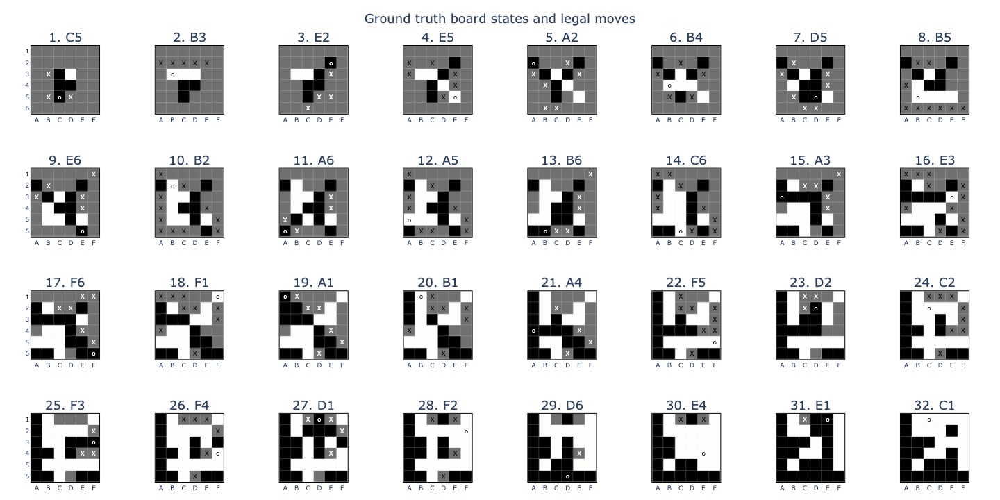
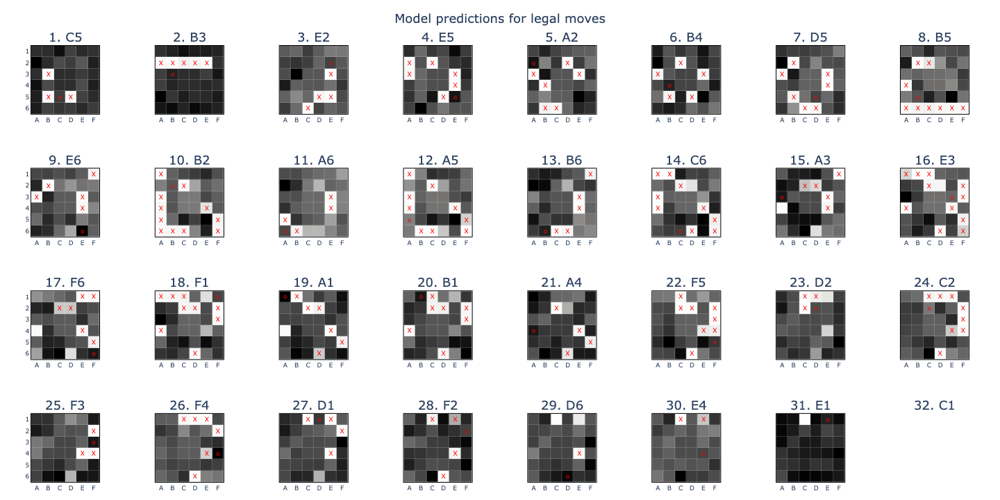
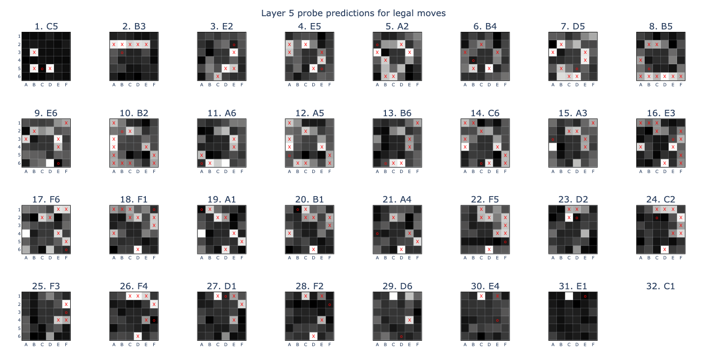
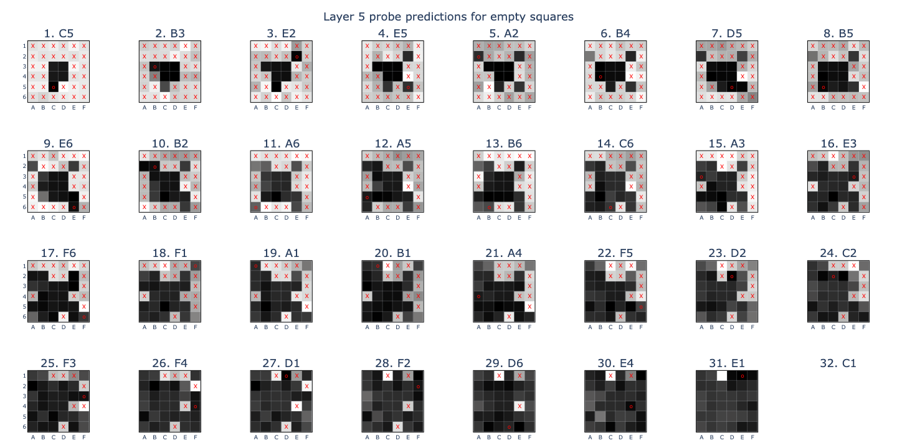
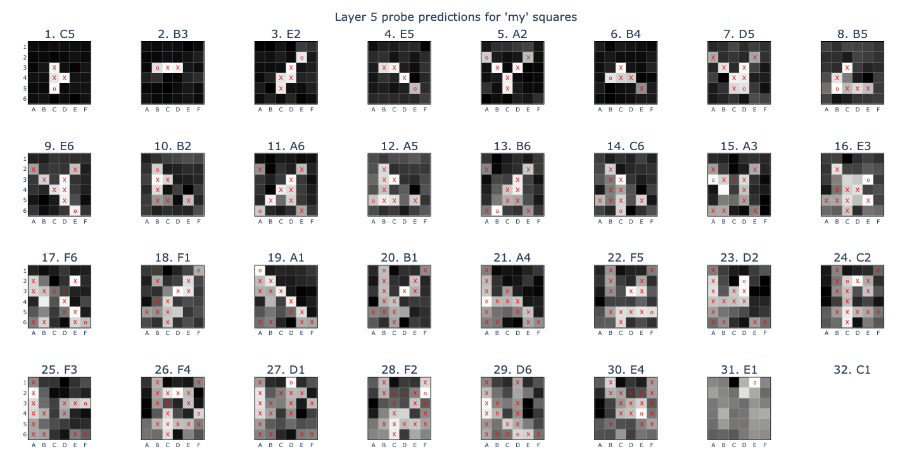

# OthelloGPT-mini

Replicating the Othello GPT paper (https://arxiv.org/pdf/2210.13382) and Neel Nanda's follow up on linear probing (https://www.neelnanda.io/mechanistic-interpretability/othello), using a 6x6 board to reduce training times.

## Notes

- Focus on some core investigations and simplify aggressively
    - We want to discover robust, scalable mech interp techniques from the way that OthelloGPT learns rules
    - Reducing to 6x6 was a good move: increase iteration speed without reducing complexity too much
    - Shouldn't have tried including pass moves, this complicates too much
    - Still conflicted about using mp for data gen. KISS vs cpus go brrrrrrr.
- (B)log the process as you go!

- Original side goal was it'd be cool to have an LLM that explains itself

## Observations

- Reduce model to 2 layers, 8 heads, 128 dims
    - Train probes on blocks.0.hook_resid_pre (linear_probe_20250203_173005_embed.pt)
        - Knows which move was just played => not empty, mine
        - "Empty" seems to record statistical priors of an outwardly expanding ring, with corners filled last
        - "Mine" performance degrades with seq len, ends up only recording latest move
        - Pos embed seems to have an alternating pattern mod 2. Last layer is really active
    - Train probes on blocks.0.hook_resid_post (linear_probe_20250201_084310.pt)
        - When run on embedded tokens, "legal" and "empty" predict the latest move, and "mine" shows some captures as well as mines!
        - "empty" almost perfect, "mine" degrades over seq len (TODO check acc over #times flipped, also #tiles flipped when flipped)